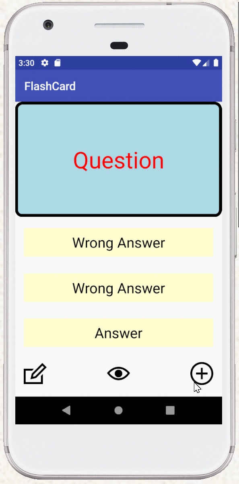
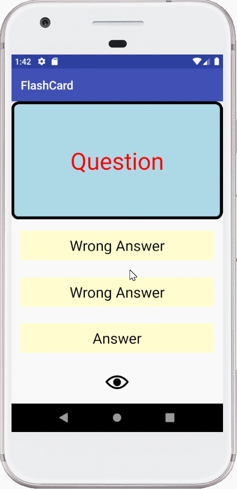

FlashCard

📝 `NOTE` Paste this template at the top of your existing `README.md` file from the last lab.

## Lab 2

### App Description
Allows editing the questions and answers

### App Walk-though

## Required
- [x] User can click on a ‘+’ button that takes the user to new ‘Add Card Screen’
- [x] The 'Add Card Screen' has a cancel button to take the user back to the main screen
- [x] User can enter and submit a Question and Answer through the 'Add Card Screen'
- [x] User will see the card they just created on the main screen when they press the 'Save Button'
- [x] Push your progress to GitHub!

## Optional
- [x] User can edit a card
- [x] An error message is shown if the user doesn't enter both a Question and an Answer
- [x] A notification is shown if the card was created successfully
- [x] User can also enter multiple choice answers when creating a card
- [x] App is further styled and customized!

## Lab 1

### App Description
App swaps between showing the question and answer to the question. Incorrect choices will turn red, while the correct answer goes green. Visibility of options can be toggle by pressing the eye icon at the bottom.

### App Walk-though

## Required
- [x] Create New Project in Android Studio
- [x] Add a view for the front side of the flashcard to display the question
- [x] Add a view for the back side of the flashcard to display the answer
- [x] Build in logic to show the answer side when the card is tapped
- [x] Push code to GitHu
## Optional
- [x] toggle the flashcard between the question side and the answer side
- [x] Style the question and answer side of the card to better distinguish between the two sides
- [x] Add selectable multiple choice answers beneath the card
   - [x] Change the background color of the multiple choice answers when clicked to indicate whether the question was answered correctly
- [x] Further customize and style the card
