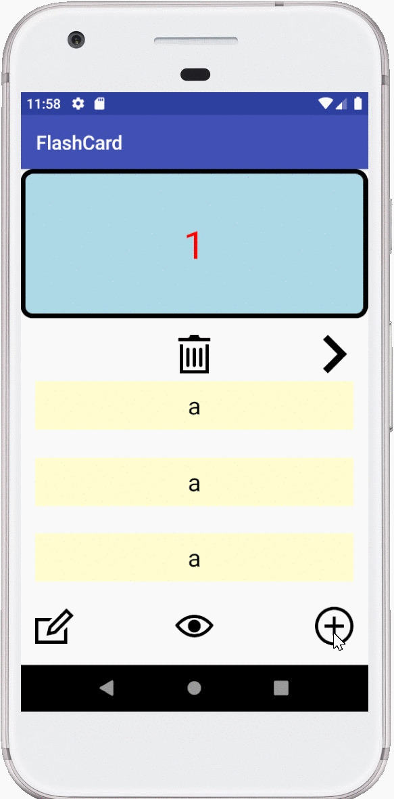
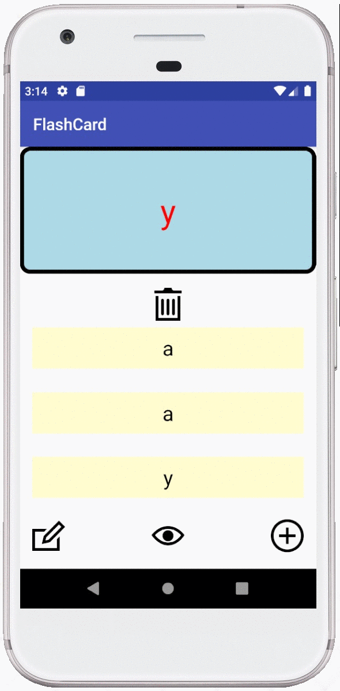

FlashCard

## Lab 4

### App Description
Add transition effects between changing activies and cards

### App Walk-though

## Required
- [x] User sees a transition animation when going from the main screen to the add card screen.
- [x] User sees a reveal animation when the flashcard is tapped and the answer is shown
- [x] User sees flashcards animating in / out when the 'next' button is tapped

## Optional
- [x] Extra styling is added!
- [ ] User sees a countdown timer for each question
- [ ] User sees a 'card flip' animation when the card is tapped
- [ ] User sees a celebration animation with confetti when they answer a question correctly

## Lab 3

### App Description
Allows data to persist using a database

### App Walk-though

## Required
- [x] User can create a card and still see their created card when the app is relaunched.
- [x] User can create muliple cards and browse through all created cards

## Optional
- [ ] User can delete a card and no longer see it in their deck anymore
- [ ] Flashcards are shown in random order instead of the order they were created in
- [x] User can edit a card and see the edit saved when they browse through their deck of cards
- [x] User can create flashcards with multiple answers and be able to browse through cards with multiple choice answers shown

